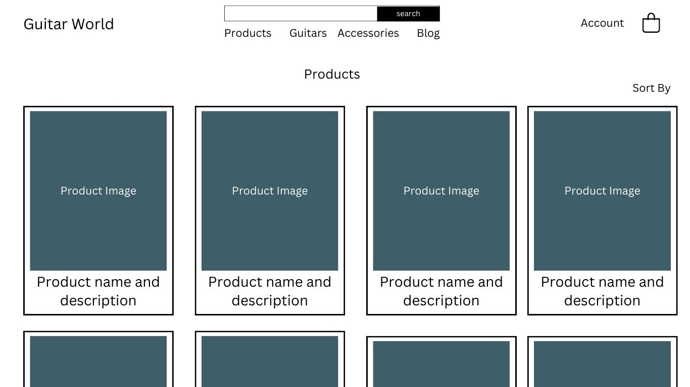
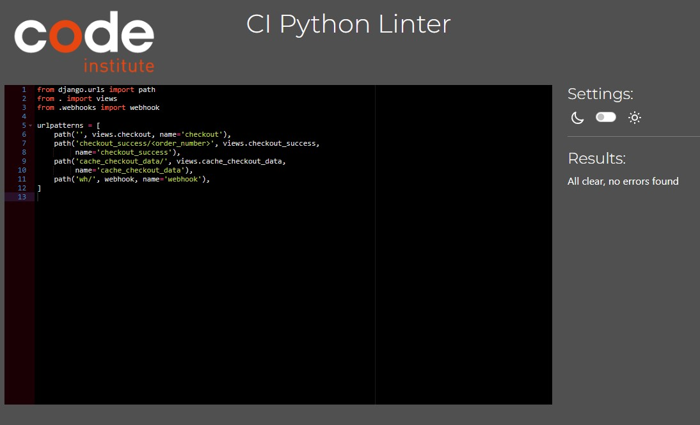

# Guitar World
This website was designed and developed as an e-commerce store for the sale of musical instruments, predominantly guitars, and their associated accessories.

## Audience
This website can be of interest to a wide variety of consumers between ages 8 to 80. As musical instruments can appeal to such a broad range of ages, I decided to make the website as clean as possible without specific 'genre' styling, as to not discourage any shopper from using the site. The site will be marketed by using social media posts and ad campaigns, along with newsletter signup functionality.

## Market Analysis
- There are a wide number of competitors in this market, the largest being Thomann, a German based musical instrument company.
- Othe rsimilar e-cmmerce platforms would be Gear4Music, Muziker, Waltons, Musicmaker and XMusic (the latter 3 being Irish based companies)

[Link to my Github Repository](https://github.com/Christo107/guitar_world)

The live website on Github can be accessed at the following link: [View my Live Website on Heroku here](https://guitar-world-58b9d23ae102.herokuapp.com/)

## CONTENTS

* [Introduction](#guitar-world)
    *  [Audience](#audience)
    *  [Market Analysis](#market-analysis)
* [Sections and Pages](#sections-and-pages)
    *  [Header](#header)
    *  [Hero image and CTA](#hero-section-and-cta)
    *  [Shop by Category section](#shop-by-category-section)
    *  [Register Page](#register-page)
    *  [Login Page](#login-page)
    *  [Footer](#footer)
    *  [Newsletter](#newsletter)
    *  [Contact Us](#contact-us)
    *  [Product Page](#product-page)
    *  [Product Detail page](#product-detail)
    *  [Shopping Bag](#shopping-bag)
    *  [Checkout](#checkout)
    *  [Profile Page](#profile-page)
    *  [Blog Post List](#blog-posts)
    *  [Admin](#admin)   
* [User Experience](#user-experience)
    *  [User Stories](#user-stories)
* [Marketing](#marketing)
    *  [Social Media](#social-media)
    *  [Newsletter](#newsletter-signup)
* [Design](#design)
    *  [Database Schema](#database-schema)
    *  [Agile](#Agile methodologies)
    *  [Colour Palette](#colour-palette)
    *  [Typography](#typography)
    *  [Imagery](#imagery)
    *  [Wireframes](#wireframes)
    *  [Accessibility](#accessibility)
* [Technologies Used](#technologies-used)   
    *  [Languages Used](#languages-used)
    *  [Frameworks, Libraries and Programs Used](#frameworks-libraries-and-programs-used)
* [Testing](#testing)
    * [Validator Testing](#validator-testing)
    * [Responsiveness Testing](#responsiveness-testing)
    * [Accessibility Testing](#accessibility-testing)
    * [User Story Testing](#user-story-testing)
* [Bugs](#Bugs)
* [Deployment](#deployment)
* [Credits](#credits)
* [Acknowledgements](#acknowledgements)

## Sections and Pages

### Existing Sections
- #### **Header**
    - The header contains the name of the website which acts also as a homepage link on desktop version on the far-left of the screen.
    - in the centre lies a search bar, and the main navigation links to Home, All-Products, Guitars, Accessories and Blog Posts.
    - On the far-right, links to My Accounts and the shopping Bag total are present.
    - A banner advertising the amount required to receive free delivery is shown.

Header Images

- #### **Hero Section and CTA**
    - This section contains the a large hero image of a les paul guitar along with a tagline "Find your dream instrument today" to entice shoppers.
    - A Call to Action button for Shop Now is also present and brings shoppers directly to the products page.

Hero Image and CTA Section Images

- #### **Shop by Category Section**
    - A user has the option to click on any of the categories created in the admin for the various products.
    - This provides the shopper with an alternative way to enter the products pages instead of using the navbar dropdown.
    - An enticing zoom effect is used on the images of the category to draw the user in.

Shop By Category Images

- #### Register Page
    - This page allows users to signup to create a profile where their data can be stored for future purchases. 
    - This uses the allauth features for authorisation

Register page images

- #### Login Page
    - This page allows already registered users to login to their accounts and access the features.

Login Page Images

    
- #### **Footer**
    - At the bottom of the pages, the footer contains a tagline description for the company and links to their Facebook profile along with the developer's github page
    - It features links to various areas of the website including Home, products, Account and Blog
    - A link to message the company brings the user to the Contact Us page
    - Finally, a newsletter signup feature is present using mailchimp to process the email signup process

- #### **Newsletter**
    - The website utilises the mailchimp mass emailing service in order to communicate information with the shoppers
    - They are able to signup in the footer section of the website.

- #### **Contact Us**
    - Users are able to send messages to the company via the Contact Us Form
    - The link to reach this page is contained within the footer of the website called 'Message Us'
    - This message, if form is validated, is then displayed on the admin side of the website
    - A future feature is to include a list of message received on the frontend for Admin Users with reply functionality

- #### **Product Page**
    - Users can navigate to the product pages in a number of ways
        - Via the navbar All Products>By Price/Rating/Category/All Products
        - Via the navbar Guitars>Electric/Acoustic/Electric Acoustic/All Guitars
        - Via the navbar Accessories>Strings/Tuners/All Accessories

- #### **Product Detail**
    - By clicking a particular product, users are brought to the product detail page.
    - This page contains extra information of the product, and ordering functionality.
    - Registered users can also leave a review of a particular product if they wish.

- #### **Shopping Bag**
    - By clicking add to bag on a product detail page, each item is added to the shopping bag
    - This can be accessed by clicking the icon in the top right corner of the screen
    - A summary of the items added to bag are shown including image, description, quantity and price

- #### **Checkout**
    - Once a user is happy to proceed to paying for the items, they are brough to the secure checkout page.
    - They are asked to enter details including name, email, address and billing information
    - Registered users have the option to save details for next purchase if they wish

- #### **Profile**
    - Registered users are given a profile page which displays their personal information and order history

- #### **Blog posts**
    - Another feature of the website is the Blog section
    - This contains blog posts uploaded by Admin on relevant music-related stories

- #### **Admin**
    - The Admin section provides access to superusers to modify many aspects of the website
    - They have access to the Product pages to add or edit products
    - Blog Posts can be added or removed as necessary
    - New product categories can be added or modified
    - Users and Orders can be tracked and modified also

### Future Features

- #### Blog by Category
    - I would like to add a category field to the blog posts to enabling searching by subject

## User Experience

### User Stories

#### Client Goals
- To have an accessible, responsive website that is easy to navigate and encourages users to engage with the content contained within.
- To encourage further spending by showing free delivery thresholds if shoppers are under the threshold

##### Delivered features
- **Manage Products**
    - As a Site Admin I can create, read, update and delete products so that I can manage my store content.
- **Create Draft Products**
    - As a Site Admin I can create draft products so that I can finish adding the product at a later time.
- **Add Blog Posts**
    - As a Site Admin I can create, read, update and delete blog posts so that I can manage my website content.
- **Account Registration** 
    - As a Site User I want to register an account so that I can purchase products and save my information
- **Login**  
    - As a site user I can login to my registered account so that I can access complete my orders  on the store and see previous orders on my account.
- **Logout** 
    - As a site user I want to logout of my registered account so that I can keep my account safe from other users.
- **Personal Details**  
    - As a site user I want to save my personal shopping details securely for future visits to the website.
- **Review a Product**  
    - As a Site User I can leave reviews on a product so that I can engage with other users
- **View Reviews** 
    - As a Site User / Admin I can view reviews on an individual post so that I can read the replies to a post
- **View Product List** 
    - As a Site User I want to view a list of products so that I can select one to purchase or review further details of.
- **Open a Product Detail page** 
    - As a Site User I want to click on a product so that I can read the full information on that product.
- **Product Filter**
    - As a Site User, I want to filter the selection of products so that I only see products that match a certain criteria.
- **Product List Pagination**
    - As a Site User I want to view a paginated list of products so that I can easily select a product to view.
- **Product Sorting**
    - As a Site User I can sort the product list using a number of variations e.g. Price, name.
- **Product Reviews**
    - As a registered Site User, I want to add reviews to products so that I can tell others about them or ask questions.
- **View Previous Orders**
    - As a Site User, I can see my previous orders so I can find out what I ordered and when it will arrive.
- **Checkout success**
    - As a site user, I can proceed to purchase the items I wish to buy without barriers

##### Non-Delivered features
- **Approve Reviews** 
    - As a Site Admin I can approve or disapprove Reviews so that I can filter out objectionable comments
- **Edit Reviews** 
    - As a Site User I want to edit my reviews on a product so that I fix typos or mistakes
- **Product Wishlist** 
    - As a Site User, I can save a particular product to look at later in a wishlist

## Marketing

### Social Media
- A facebook page was created as a way to reach a bigger audience.
- The page contains the main details of the business, along with posts on the products available.
- It will remain an important part of the marketing strategy of Guitar World
- Future creation of an Instagram and TikTok account proposed.
[Facebook page link](https://www.facebook.com/profile.php?id=61551557630644)

Facebook page screenshots

### Newsletter Signup
- Email newsletters will be a feature of the website using the Mailchimp service to send details of upcoming products and competitions to interested users.
- The signup section is located in the footer of the website.

## Design

### Database Schema
- I used ElephantSQL to build the Database

Click to see Database schema PDF

[Database Schema](./media/readme_docs/Database%20Schema.pdf)

### Agile Methodologies
- Github Projects was used to keep track of the various Epics, User Stories and progress of the prject.
- The project can be found here (https://github.com/users/Christo107/projects/3)

### Colour Palette

The website uses a simple clean black and white colour palette which allows the product images to stand out and entice the customer to purchase.

### Typography
- Verdana font used for review content for readability
- Lato font used for headers and prominent titles

### Wireframes
- I designed the website firstly through hand drawn sketches that were then turned into basic wireframes on Canva.

Desktop Wireframe images

- 
- 
- 

Mobile Wireframes images

- 
- 
- 

### Accessibility

## Technologies used

### Languages used
- HTML5
- CSS3
- Javascript
- Python

### Frameworks, Libraries and Programs used
- [GitHub](https://github.com)
- [Gitpod](https://gitpod.io/workspaces)
- [Figma](https://www.figma.com/)
- [Optimizilla Image Compressor](https://imagecompressor.com)
- [Fontawesome](https://fontawesome.com/)
- [Am I Responsive](http://ami.responsivedesign.is/)
- [Coolers.co](https://coolors.co)
- [Chrome Dev Tools](https://www.google.com/intl/en_ie/chrome/)
- [A11y color contrast validator](https://color.a11y.com/Contrast/)
- [Favicon.io](https://favicon.io/)
- [Django]
- [Amazon Web Services](https://aws.amazon.com/)
- [Bootstrap]
- [Heroku](https://www.heroku.com)
- [Canva]
- [Stripe](https://www.stripe.com)
- [ElephantSQL](https://www.elephantsql.com/)

## Testing
The website was tested for markup and CSS validation along with javascript, responsive design and accessibility using multiple browsers including Chrome, EDGE, and Firefox.
Please see screenshots of the results below:

### Validator Testing
- HTML
-[W3C Markup Result](./media/readme_images/HTML%20first%20check.jpg)
    - This validator showed several errors in relation to li items as children of nav element. Unfortunately, i was unable to locate the shown errors in the code in order to fix them before submission.
- CSS
- [W3C CSS Validator first run](./media/readme_images/CSS_validator_first.jpg)
    - The CSS validator showed 2 errors to be fixed. These were both fixed for final deployment as shown below:
- [W3C CSS Validator fixed](./media/readme_images/CSS_validator_fix.jpg)
- Javascript
    - The javascript code was run through jshint to check for any errors. No errors were identified.
- Python
    - The python code was run through Code Institute's Pep8 Linter to check for errors. It passed with no errors apart from the automatically generated auth password validators in Settings.py

See PEP8 linter results for each file

See PEP8 linter result

See PEP8 linter result

See PEP8 linter result

See PEP8 linter result

See PEP8 linter result

See PEP8 linter result

See PEP8 linter result

See PEP8 linter result

See PEP8 linter result

See PEP8 linter result

See PEP8 linter result

See PEP8 linter result

See PEP8 linter result

See PEP8 linter result

See PEP8 linter result

See PEP8 linter result

See PEP8 linter result

See PEP8 linter result

See PEP8 linter result

See PEP8 linter result

See PEP8 linter result

See PEP8 linter result

See PEP8 linter result

See PEP8 linter result

See PEP8 linter result

See PEP8 linter result

### Responsiveness Testing
- The website was tested for responsiveness using the Chrome and Firefox browsers and their associated Developer Tools. It was also tested on a real mobile phone (Samsung A53) to look for display problems on the smaller screen.
#### Chrome Developer tools
- A variety of screen sizes were checked for responsiveness using the Developer tools from 4K displays at 2560px wide, laptop sizes 1440px and 1024px, tablets at 768px, and a variety of mobile sizes down to 320px width. All elements maintained functionality and visibility in all scenarios, however, there were some issues with responsiveness on images on the actor_detail page on smaller devices.
- A Lighthouse report was run several times to gauge the performance, accessibility, best practice and SEO scores. 

#### Lighthouse Scoring

 - [Lighthouse scoring Homepage Desktop](./media/readme_images/homepagelighthouse_desktop1.jpg)
 - [Lighthouse scoring Products Desktop](./media/readme_images/productpagelighthouse_desktop2.jpg)
 - [Lighthouse scoring Homepage Mobile](./media/readme_images/homepagelighthouse_mobile1.jpg)
 - [Lighthouse scoring Products Mobile](./media/readme_images/productpagelighthouse_mobile1.jpg)

### Accessibility Testing
- Multiple tests were run on the website using Lighthouse and A11y Color Contrast Accessibility Validator to examine any accessibility issues. https://color.a11y.com/
- [Colour Contrast Results](./media/readme_images/colour_contrast_results.jpg)

#### Firefox
- Firefox's built in colour blindness simulator was used to identify any areas where sufficient colour contrast was not present. No such areas were found.

### User Story Testing
- The delivered user stories were manually tested to ensure all acceptance criteria were met
- 
- 

## Deployment
I used Gitpod to develop the website and the site was deployed using Heroku.

- The steps to deploy are as follows:

- Login or create an account at Heroku.
- On the main page, select the 'New' button and then select 'Create New App' from the drop-down.
- Give your app a unique name and choose your relevant region e.g. Europe.
- In the 'Settings' tab of your app select 'Reveal Config Vars'.
- Add a value for 'SECRET_KEY' connecting to your django environment.
- Add a value for 'DATABASE_URL' connecting to your postgreSQL database.
- Add a value for 'ClOUDINARY_URL' connecting to cloudinary's cloud hosting service for media.
- Back at the top of the page select the 'Deploy' tab.
- Select GitHub as preferred deployment method, confirm connecting to Github if not automatic.
- Connect to your relevant repository on GitHub.

- Ensure DEBUG = False in settings.py when making final deployment

To Clone
You can clone this project by executing the following:
- Open this project on GitHub here.
- You will be provided with three options to choose from, HTTPS, SSH or GitHub CLI, click clipboard in order to copy.
- Once selected, the forked project will be in your repositories.
- Open up a new terminal.
- Adjust the current directory to be the location you wish the cloned directory to be.
- Type 'git clone' and paste the URL copied above in step 2.
- Hit 'Enter' and the project will be successfully cloned.

To Fork
- Open this project on GitHub here.
- The fork button is found at the top of the page.
- The forked project will be in your repositories.

The live link can be found here - https://guitar-world-58b9d23ae102.herokuapp.com/

## Bugs
### Fixed Bugs
- **Navbar styling on small mobile.**
    - navbar icons were wrapping to next line on small mobile screens. Fixed by changing padding in media query
- **Product Reviews not appearing on Product Detail page.**
    - syntax in views and models was incorrect. Fixed with help from Roman Rakic on Slack.
- **Footer not displaying fulll page width on some pages**
    - Changed max-width property on footer

### Known Bugs
- **Product pagination non-functioning**
    - paginating the product list was not working correctly, and is awaiting fix for next deployment(code removed for submission)
- **Edit and Delete reviews**
    - Admin should have the functionality to edit and delete reviews on the frontend. This is not working at present.(code removed for submission)
- **Approve reviews**
    - Admin should have the functionality to approve reviews before they are listed on the frontend. This is not working at present.
- **Payment Intent Succeeded**
    - At present, there is an error on stripe for the payment intent succeded.
    - This appears to relate to the webhooks not functioning correctly and not seeing that an order has already been created.
## Credits

### Code
- The code comprises of code based on Code Institute walkthroughs "Boutique Ado" and "I think therefore I blog" that have been customised to meet the specific requiremnets of the project, alonside custom code and models written by me.

### Content

- The text content of the website was taken from the Thomann, Gear4Music and Guitar Noise website.
- The social media icons in the footer were taken from [Font Awesome](https://fontawesome.com/)

### Media
- Product images and details are taken from the Thomann and Gear4Music websites.
    - https://www.thomann.de/
    - https://www.gear4music.com
- Blog post images and content taken from https://www.guitarnoise.com/
- Icons sourced from Font Awesome

## Acknowledgements
 - Roman Rakic for his assistance